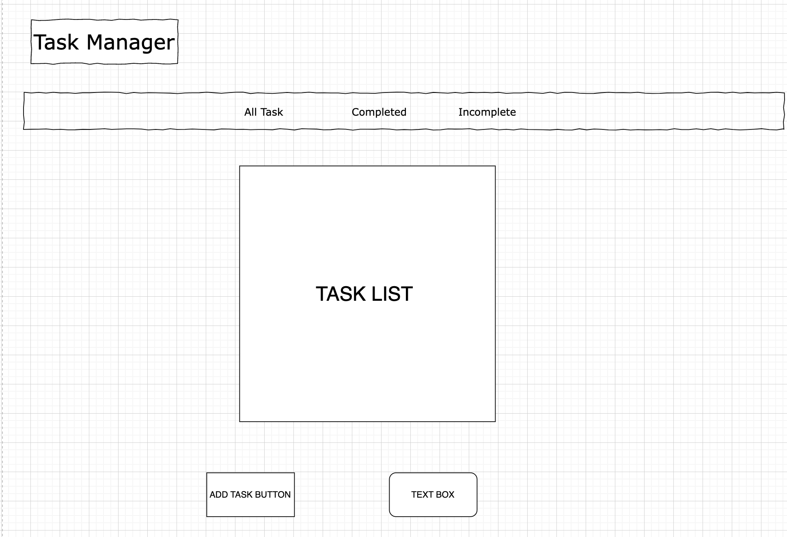

# Task-Manager Application

## Description
This application was created to help individuals manage their tasks. You are able to add new tasks as they come or delete task once they are completed. The user has a way of interacting with the application to control the staus of the task such as marking it as "Completed" for example. The user is able to toggle between incomplete and completed tasks.

## Screen Shot

## Technologies Used

* React
* CSS
* Bootstrap

## User Stories

1. As a user, I want to be able to add or delete task so I cam update the list of tasks.
2. As a user, I want to be able to mark the tasks as completed or incomplete so I can prioritize certian tasks.
3. As a user, I want to filter my tasks to focus on different tasks based by their status.

## WireFrame

## Next Steps

1. Allow a user to create an account to save their profiles.
2. Add a feature for users to be able to look at old lists.
3. Allow users to set task priority by adding a dropdown to select tasks importance status.

## Author

Martin Ramirez - [@LinkedIn](www.linkedin.com/in/martin-ramirez-871118334/)
